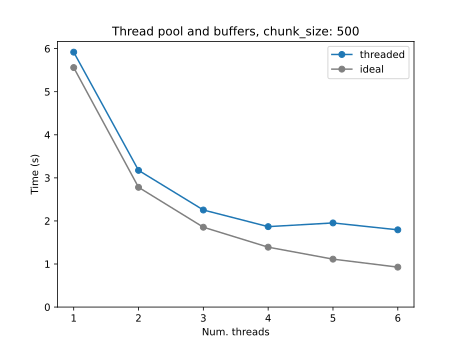
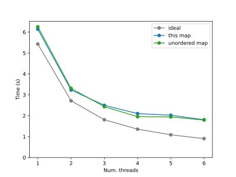
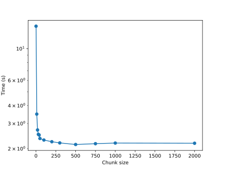
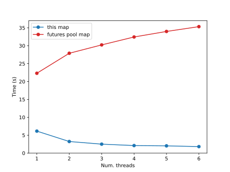
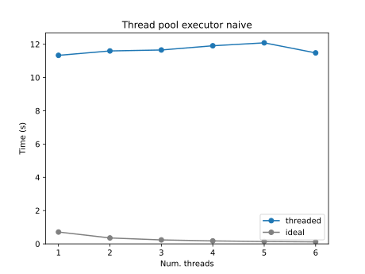
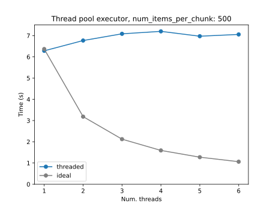
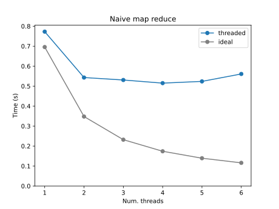
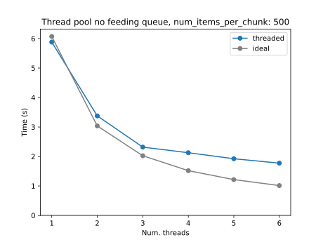

# threaded-map-reduce

A Python library that implements **map**, **unordered map**, and **map-reduce** using threads.

This library is intented to be performant for CPU-bound tasks.
The map implementation has been tested to be much more performant than the map method of the [futures.ThreadPoolExecutor](https://docs.python.org/3/library/concurrent.futures.html#concurrent.futures.ThreadPoolExecutor) class of the standar library.

---

## Features

* **Parallel map** with deterministic order: `map`
* **Parallel unordered map** for maximum throughput: `map_unordered`
* **Parallel map-reduce**: `map_reduce`
* It groups items into chunks to reduce the parallelization overhead
* No external dependencies

---

## Installation

```bash
pip install threaded-map-reduce
```

(Or, if you use `uv`:)

```bash
uv pip install threaded-map-reduce
```

## Quick Start

### 1. Parallel map (ordered)

```python
from threaded_map_reduce import map

def square(x):
    return x * x

nums = range(1000)
result = list(threaded_map(square, nums, num_computing_threads=4, chunk_size=100))
print(result[-10:])
```

### 2. Parallel map (unordered)

Faster, but order is not preserved:

```python
from threaded_map_reduce import map_unordered

nums = range(1000)
result = list(map_unordered(square, nums, num_computing_threads=4, chunk_size=100))
print(sorted(result))
print(result[-10:])
```

### 3. Parallel map-reduce

Useful for reductions such as sums, counts, or any associative operation.

```python
from operator import add
from threaded_map_reduce import map_reduce

def square(x):
    return x * x

nums = range(0, 1000)
result = map_reduce(square, add, nums,
                    num_computing_threads=4,
                    chunk_size=100)
print(result)
```

## API Summary

### `threaded_map(map_fn, items: Iterable, num_computing_threads: int, chunk_size: int = (100,)`

Runs `map_fn` over every item in parallel and yields results keeping input order.

### `threaded_map(map_fn, items: Iterable, num_computing_threads: int, chunk_size: int = (100,)`

Same as above, but yields items in any order.

### `map_reduce(map_fn, reduce_fn, iterable: Iterable, num_computing_threads: int, chunk_size: int = 100,)`

Maps items in parallel, reduces mapped chunks using the provided reducer function, and returns a single result.

## Performance

### map-reduce

The `map_reduce` performance was tested with the following test:

- Task: Count the number of primes up to 5,000,000
- Workload: CPU-bound, using the same `is_prime` implementation for all tests (see the code at the end of this section)
- Chunk size for all parallel map implementations: 500
- Repetitions: 5 runs per configuration, reporting the mean runtime
- Python: free-threaded CPython 3.14.0
- Hardware: laptop with Intel® Core™ [i7-1260P](https://www.intel.com/content/www/us/en/products/sku/226254/intel-core-i71260p-processor-18m-cache-up-to-4-70-ghz/specifications.html) (4 performance cores, 6 efficiency cores)



### map

To study the performance of the `map` function implemented in this library we ran a similar benchmark:

- Task: check whether each integer from 1 to 5,000,000 is prime
- Workload: CPU-bound, using the same `is_prime` implementation for all tests (see the code at the end of this section)
- Chunk size for all parallel map implementations: 500
- Repetitions: 5 runs per configuration, reporting the mean runtime
- Python: free-threaded CPython 3.14.0
- Hardware: laptop with Intel® Core™ [i7-1260P](https://www.intel.com/content/www/us/en/products/sku/226254/intel-core-i71260p-processor-18m-cache-up-to-4-70-ghz/specifications.html) (4 performance cores, 6 efficiency cores)



The performance of this library’s map implementation improves with the number of threads.
For this task there is no appreciable difference between the ordered and unordered maps.

Compared with the ideal scaling, for two and four threads our implementation is 1.19 and 1.54 times slower respectively.
In an ideal scenario, the runtime with N threads to perform the task should be the time with just one thread (using the standard non-threaded [map](https://docs.python.org/3/library/functions.html#map) implementation) divided by N.

### Chunk size

The chunk size is a critical parameter for performance.
Both map and map_reduce process items in chunks, and the parallelization overhead depends strongly on how many items are grouped into each chunk.

Using very small chunks (e.g. one item per chunk) usually produces poor performance, because the cost of thread scheduling and queue operations dominates the useful work.
Using very large chunks eventually stops giving additional speedups, and may increase memory usage.

We used the same banchmark as in the previous map section. A chunk size of 1 is 6.7× slower than a chunk size of 500, and increasing the chunk size beyond 500 does not reduce the runtime further.
The optimal chunk size depends on the specific workload.

Note that each chunk is materialized as a list before being processed, so larger chunk sizes increase memory usage.

Time used to carry out the task for different chunk sizes:



### ThreadPoolExecutor.map vs this library’s `map`

We compared, using the same mapping benchmark, the performance of this library's map implementation with the one available in the [ThreadPoolExecutor](https://docs.python.org/3/library/concurrent.futures.html#concurrent.futures.ThreadPoolExecutor) found in the [futures module](https://docs.python.org/3/library/concurrent.futures.html) of the standard library: 



In this benchmark, the `ThreadPoolExecutor.map` implementation is 4.11 (1 thread) times slower than the `threaded_map` implementation when using a single
thread, and its performance degrades further as the number of threads
increases (e.g. 5.99 slower with (4 threads)).


### is_prime function

The is_prime function used was:

```{python}
def is_prime(n):
    if n == 1:
        return False
    elif n == 2 or n == 3:
        return True
    elif n % 2 == 0:
        return False
    elif n < 9:
        return True
    elif n % 3 == 0:
        return False
    r = int(sqrt(n))
    for f in range(5, r + 1, 6):
        if n % f == 0:
            return False
        elif n % (f + 2) == 0:
            return False
    return True
```


## `map-reduce` alternative implementations

The `map-reduce` function was implemented using different architectures to check which one was the most performant.

### ThreadPoolExecutor

Architecture:
- A [ThreadPoolExecutor](https://docs.python.org/3/library/concurrent.futures.html#concurrent.futures.ThreadPoolExecutor) is created.
- Each item a mapping task is created using the ThreadPoolExecutor's map method and the task is represented by a [Future](https://docs.python.org/3/library/concurrent.futures.html#concurrent.futures.Future) object that eventually will hold the result of the mapping.
- The `Future` objects are used by the reduce function.



The result of this approach was pretty bad, the execution time was around 10 times larger than with a naive non-threaded approach and it did not improved wit the number of threads.

This is the code for this approach.

```{python}
def map_reduce_with_executor_naive(
    map_fn,
    reduce_fn,
    items,
    max_workers,
    initial_reduce_value=None,
):
    with ThreadPoolExecutor(max_workers=max_workers) as executor:
        futures = []
        reduced_result = initial_reduce_value
        for item in items:
            future = executor.submit(map_fn, item)
            futures.append(future)

            if len(futures) > max_workers:
                future = futures.pop()
                result = future.result()
                reduced_result = reduce_fn(result, reduced_result)

        for future in futures:
            reduced_result = reduce_fn(future.result(), reduced_result)
    return reduced_result
```

### ThreadPoolExecutors with chunk

Another attempt using ThreadPoolExcutor was done, but instead of mapping every item, they were packed in chunks and those chunks were then mapped and reduced.



The time in this case was similar to the non-threaded one, but it did not improved with the number of threads.


### Thread-safe iterator and computing threads

Iterators are not thread safe in Python, but we can use a lock to solve the issue.

```{python}
class ThreadSafeIterator(Iterator):
    def __init__(self, it):
        self._it = iter(it)
        self._lock = threading.Lock()

    def __next__(self):
        with self._lock:
            return next(self._it)
```

Now that we have a thread safe iterator we can spawn a set of computing threads that will do the map and reduction put their results in a queue and, finally, an additional step to reduce the results of each computing thread.



The time with 1 thread in this implementation is similar to the non-threaded map-reduce, and the time was cut down when 2 or 3 computing threads were added, but it did not improved with more threads.

### Chunks and computing threads

In the implementation based on the thread-safe iterator the lock used to yield each item might be the bottleneck, so more computing threads might not improve the performance because they will be waiting to get an item to process.

The approach used used by this library is similar to the previous one, but instead of processing items, it processes chunks of items.
The class in charge of delivering the chunks to be mapped and reduced makes sure that the chunk yielding is thread-safe by using a lock.

```<python>
class _ChunkDispenser(Iterator):
    def __init__(self, it, chunk_size):
        self._it = iter(it)
        self._lock = threading.Lock()
        self._chunk_size = chunk_size

    def __next__(self):
        with self._lock:
            chunk = list(itertools.islice(self._it, self._chunk_size))
            if not chunk:
                raise StopIteration
            else:
                return chunk

```

The chunks are then mapped and reduced by a pool of computing threads that put their final reduced result into a queue that the main thread reduces when their computing is done.



This implementation gave the best result.

### More complex implementations

Other more complex approaches we also tried, but none worked as well as the previous one.

## License

MIT License.
