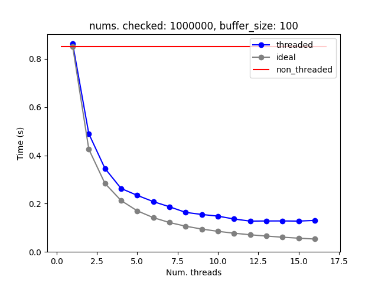
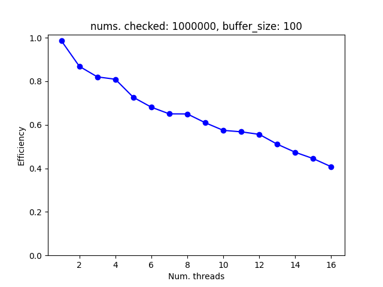
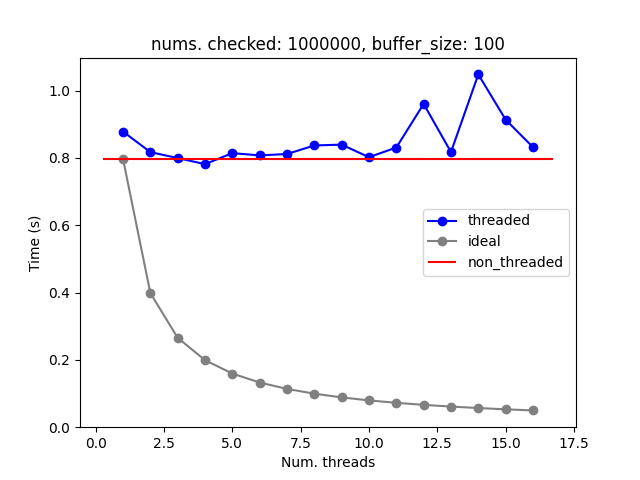
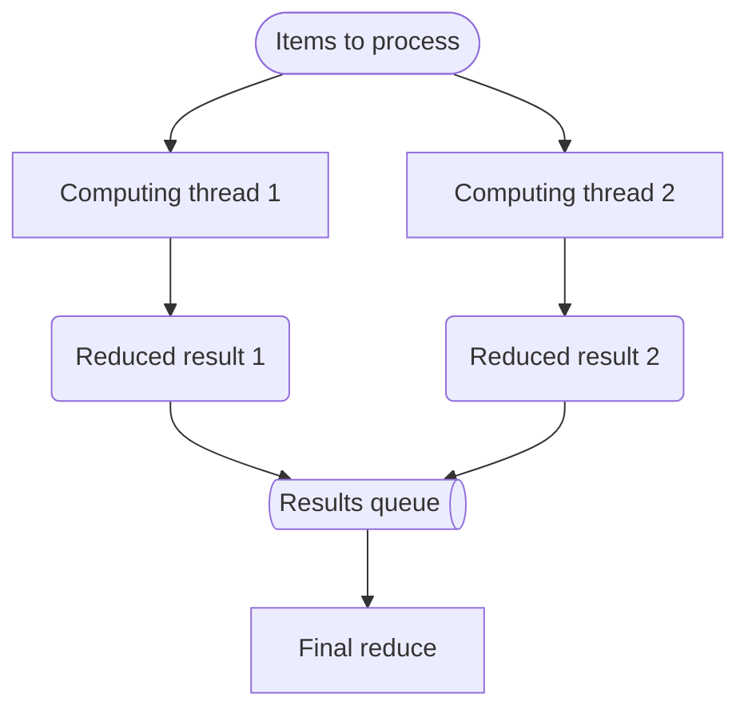
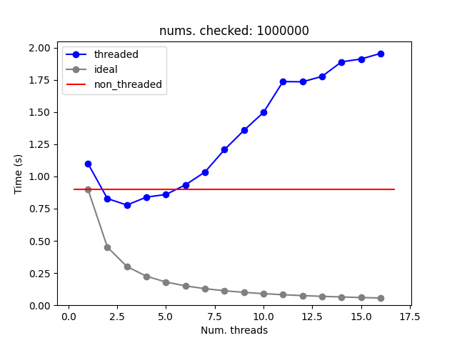
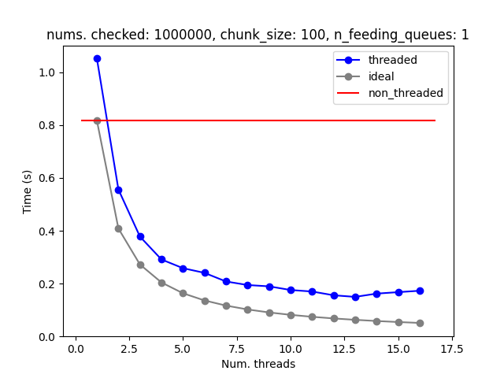

# Threaded Map-Reduce for Free-Threaded Python

A implementation of the [map-reduce](https://en.wikipedia.org/wiki/MapReduce) pattern designed specifically for Python 3.13+ with free-threading support. This library enables true parallel processing of CPU-intensive tasks without the limitations of the Global Interpreter Lock (GIL).


## Usage

### Basic Example

```python
from threaded_map_reduce import map_reduce
from operator import add

# Count squares of numbers 1-1000 using 4 threads
def square(x):
    return x * x

result = map_reduce(
    map_fn=square,
    reduce_fn=add,
    iterable=range(1, 1001),
    num_computing_threads=4,
    num_items_per_chunk=100
)
print(f"Sum of squares: {result}")
```

## Motivation

I do a lot of work in bioinformatics, especially in genetics, and the [free-threaded Python](https://docs.python.org/3/howto/free-threading-python.html) seems very promising for my CPU bound tasks.
Also, I am used to implement many of my computing tasks using the [map reduce](https://en.wikipedia.org/wiki/MapReduce) approach.
So I decided to try to implement a threaded map reduce and I wanted to use [iterables](https://docs.python.org/3/glossary.html#term-iterable) as the input.

So, the objective was to implement a function with an interface similar to:

```python
def map_reduce(
    map_fn: Callable[[T], U],
    reduce_fn: Callable[[U, U], U], 
    iterable: Iterable[T],
    num_computing_threads: int,
    num_items_per_chunk: int,
)
```

**Parameters:**
- `map_fn`: Function to apply to each item in the iterable
- `reduce_fn`: Binary function to combine results (must be associative)
- `iterable`: Input data to process
- `num_computing_threads`: Number of worker/computing threads to spawn
- `num_items_per_chunk`: Number of items to group together for processing

**Returns:** The final reduced result

**Important Notes:**
- `reduce_fn` must be associative (order of operations shouldn't matter)

Of course, all this makes sense when the experimental free-threaded Python is used. If you use the standard Python adding extra threads to a CPU bound task would be, at best, useless.
I have used the 3.13.5t Python provided by [uv](https://docs.astral.sh/uv/guides/install-python/).

## Performance

To check the performance of the implementation I have counted the number of primes up to a certain integer. The testing machine has a 12th Gen Intel® Core™ i7-1260P, 8 efficient and 4 performance cores with 16 total threads, and is running Debian with a 6.12.38 kernel.

The time required to count the number of primes below 1 million was:



Ideally the time required to do the calculation should be equal to the time required to do it without using threads divided by the number of processors.
As it can be seen, the threaded performance is worse than expected. There's always, even when using just one thread, an overhead due to the parallelization of the computing.
This is expected in any parallel algorithm and the objective is to be as close as possible to the ideal.

One measure usually employed to see how far we are from the ideal case is the efficiency: time for optimal serial algorithm on one processor / (time for parallel algorithm on P processors * number of processors).
The best scenario would be to have an efficiency of one, which would mean that adding any extra thread would reduce the computation time as much as expected by taking the single threaded computing as the reference.



I think that in this case the main problem might be the access to the iterator.
Getting items from an iterator is not thread-safe, that means that if you would try to use a standard iterator in a threaded application and several threads would try to get an item at the same time the behaviour could be undefined, and to prevent it Python would raise an exception.
As of the time of writing this there's already a proposal to [fix](https://github.com/python/cpython/pull/133272) this issue in cpython.

Also, remember that the CPU used in the test has only 4 performance cores, the rest are efficient cores, which means that they are slower, so my hardware would never reach the ideal case.

## Free-threaded vs standard Python

Remember that for a [CPU-bound](https://en.wikipedia.org/wiki/CPU-bound) task the threaded approach only makes sense in the newer and experimental [free-threaded Python](https://docs.python.org/3/howto/free-threading-python.html).
Running the same code with the standard Python would not improve the computation.



In fact, due to the overhead of managing the threads and their communications, the performance would be worse when running the computation through multiple threads than through just one. 
Fortunately, as it can be appreciated in the chart, the overhead of the current map-reduce algorithm is not that bad.

Note that it makes total sense to use threads with the old non-free-threaded-[GIL](https://realpython.com/python-gil/)-ed Python as long as the tasks are [I/O-bound](https://en.wikipedia.org/wiki/I/O_bound) and not CPU-bound.
If the tasks are most of the time just waiting, it makes sense to have several tasks being processed in parallel by different threads. In that way, as soon as one I/O wait is completed, the corresponding task would be done.
Otherwise every task would have to wait in line, and that's not a good idea.

## The journey

The current implementation is not the first one that I tried.
Creating a performant multithreaded map-reduce has been far from trivial to me.

### A naive threaded map-reduce is a bad idea

We could try to start with a naive approach in which we make the iterator thread-safe using a lock.

```python
class ThreadSafeIterator(Iterator):
    def __init__(self, it):
        self._it = iter(it)
        self._lock = threading.Lock()

    def __next__(self):
        with self._lock:
            return next(self._it)

thread_safe_iterator = ThreadSafeIterator(std_iterator)
```

Then several computing threads would take items in parallel until consuming all items and, finally, the partial results of these threads could be reduced in the main thread.



Unfortunately, the performance of this approach was quite bad.



My guess is that the main problem is the lock used to make the iterator thread-safe.
Many times, when a computing thread would try to get a new item, it would have to wait for other threads that would already be getting their item, so it would have to wait for the lock to be released.
This is just a guess because I don't know how to profile threaded code effectively. 

### Feeding queues and grouping items

In order to improve the algorithm I thought of two ideas:

- creating a feeding queue for the items to go to the computing threads
- grouping the items into chunks

The feeding queue is an alternative to having a lock to make the iterator thread-safe because Python [queues](https://docs.python.org/3/library/queue.html) are already thread-safe.
This is the updated architecture.


Grouping the items into chunks is a solution that I took from the standard library multiprocessing [map](https://docs.python.org/3/library/multiprocessing.html#multiprocessing.pool.Pool.map).

The improvement over the naive approach was great, this implementation made the parallelization really an improvement over the naive and single threaded cases.



### Feeding queues are unnecessary

Finally, I thought that queues might be unnecessary and that I only needed to group the items into chunks before sending them to the computing threads.

```python
class _ChunkDispenser(Iterator):
    def __init__(self, it, chunk_size):
        self._it = iter(it)
        self._lock = threading.Lock()
        self._chunk_size = chunk_size

    def __next__(self):
        with self._lock:
            # we need to hold the lock while filling the chunk because the iterator is not thread safe
            # I have tried to use a safe iterator created with my ThreadSafeIterator, but
            # it is slower than this
            chunk = list(itertools.islice(self._it, self._chunk_size))
            if not chunk:
                raise StopIteration
            else:
                return chunk
```

This approach is simpler and it even performs slightly better than the previous one with the feeding queue.
So, this is the one that I'm going to use for the time being.


## Contributions are welcomed

I'd like to improve the implementation and performance, so any suggestions, bug reports, or pull requests are welcomed! Please feel free to:

1. Open an issue for bugs or feature requests
2. Submit pull requests with improvements
3. Share your benchmarking results
4. Suggest optimizations or alternative approaches
