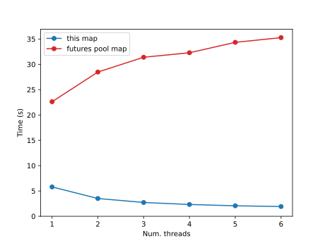
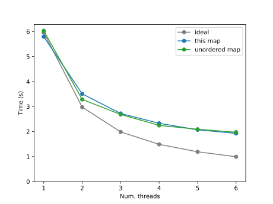

# threaded-map-reduce

A Python library that implements **map**, **unordered map**, and **map-reduce** using threads.

This library is intented to be performant for CPU-bound tasks.
The map implementation has been tested to be much more performant than the map method of the [futures.ThreadPoolExecutor](https://docs.python.org/3/library/concurrent.futures.html#concurrent.futures.ThreadPoolExecutor) class of the standar library.

---

## Features

* **Parallel map** with deterministic order: `map`
* **Parallel unordered map** for maximum throughput: `map_unordered`
* **Parallel map-reduce**: `map_reduce`
* It groups items into chunks to reduce the parallelization overhead
* No external dependencies

---

## Installation

```bash
pip install threaded-map-reduce
```

(Or, if you use `uv`:)

```bash
uv pip install threaded-map-reduce
```

---

## Performance

To compare the performance of the `map` function implemented in this library
with the standard-library implementation in
[`concurrent.futures.ThreadPoolExecutor`](https://docs.python.org/3/library/concurrent.futures.html#concurrent.futures.ThreadPoolExecutor), we ran the following benchmark:

- Task: check whether each integer from 1 to 5,000,000 is prime
- Workload: CPU-bound, using the same `is_prime` implementation for all tests (see the code at the end of this section)
- Chunk size for all parallel map implementations: 100
- Repetitions: 5 runs per configuration, reporting the mean runtime
- Python: free-threaded CPython 3.14.0
- Hardware: laptop with Intel® Core™ [i7-1260P](https://www.intel.com/content/www/us/en/products/sku/226254/intel-core-i71260p-processor-18m-cache-up-to-4-70-ghz/specifications.html) (4 performance cores, 6 efficiency cores)

### ThreadPoolExecutor.map vs this library’s `map`



In this benchmark, the `ThreadPoolExecutor.map` implementation is 3.79 (1 thread) times slower than the `threaded_map` implementation when using a single
thread, and its performance degrades further as the number of threads
increases (e.g. 5.4 slower with (4 threads)).

### Ideal scaling vs this library’s `map`



The performance of this library’s map implementation improves with the number of threads.
For this task there is no appreciable difference between the ordered and unordered maps.

Compared with the ideal scaling, for two and four threads our implementation is 1.17 and 1.54 times slower respectively.
In an ideal scenario, the runtime with N threads to perform the task should be the time with just one thread (using the standard non-threaded [map](https://docs.python.org/3/library/functions.html#map) implementation) divided by N.

The is_prime function used was:

```{python}
def is_prime(n):
    if n == 1:
        return False
    elif n == 2 or n == 3:
        return True
    elif n % 2 == 0:
        return False
    elif n < 9:
        return True
    elif n % 3 == 0:
        return False
    r = int(sqrt(n))
    for f in range(5, r + 1, 6):
        if n % f == 0:
            return False
        elif n % (f + 2) == 0:
            return False
    return True
```

## Quick Start

### 1. Parallel map (ordered)

```python
from threaded_map_reduce import map

def square(x):
    return x * x

nums = range(1000)
result = list(threaded_map(square, nums, num_computing_threads=4, chunk_size=100))
print(result[-10:])
```

---

### 2. Parallel map (unordered)

Faster, but order is not preserved:

```python
from threaded_map_reduce import map_unordered

nums = range(1000)
result = list(map_unordered(square, nums, num_computing_threads=4, chunk_size=100))
print(sorted(result))
print(result[-10:])
```

---

### 3. Parallel map-reduce

Useful for reductions such as sums, counts, or any associative operation.

```python
from operator import add
from threaded_map_reduce import map_reduce

def square(x):
    return x * x

nums = range(0, 1000)
result = map_reduce(square, add, nums,
                    num_computing_threads=4,
                    chunk_size=100)
print(result)
```

---

## API Summary

### `threaded_map(map_fn, items, num_computing_threads, chunk_size)`

Runs `map_fn` over every item in parallel and yields results keeping input order.

### `map_unordered(map_fn, items, num_computing_threads, chunk_size)`

Same as above, but yields items in any order.

### `map_reduce(map_fn, reduce_fn, items, num_computing_threads, chunk_size)`

Maps items in parallel, reduces mapped chunks using the provided reducer function, and returns a single result.

---

## License

MIT License.
